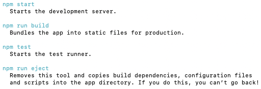

# **Create React App**

[Create React App Documentation](https://create-react-app.dev/)

[Documentation on the create-react-app-website](https://create-react-app.dev/docs/getting-started/)

[React Developer Tools CC article](https://www.codecademy.com/paths/web-development/tracks/front-end-applications-with-react/modules/react-development-setup-and-ravenous-part-1/informationals/ready-react-developer-tools)

<br>

Extra resources

- Documentation: [React Documentation: Getting Started](https://reactjs.org/docs/getting-started.html)
- Tutorial: [Intro to React](https://reactjs.org/tutorial/tutorial.html)
- Article: [Thinking in React](https://reactjs.org/docs/thinking-in-react.html)
- Article: [What the Fork is the React Virtual DOM](https://maggieappleton.com/react-vdom)
- Resource: [Awesome React](https://github.com/enaqx/awesome-react)
- Resource: [Create React App](https://github.com/facebook/create-react-app)

<br>

## **Installation**

Terminal command (Unix, OSX, Linux) to upgrade npm to the latest version:

```
sudo npm install -g npm@latest
```

btw `npx` is a package runner tool that comes with npm.

We will use `npx` to install and run `create-react-app`.

<br><br>

To initialize react in a project, in your terminal:

```
npx create-react-app reactproject --use-npm
```

p.s. `--use-npm` to avoid the default use of _Yarn_ in case you have it installed.

p.s. Use lowecase letters for the folder name.

Guide



<br>

## **React App Structure**

create-react-app created the main structure of the application and some developer settings.

React uses webpack which transforms the directories and files into static assets. With React, we can bypass manual configuration of webpack. [High-level overview of webpack's core concepts](https://webpack.js.org/concepts/)

### **package.json**

- `"private": true` is a failsafe setting to avoid accidentally publishing your app as a public package within the npm ecosystem.

- dependencies contains all the required Node modules and versions required for the application. In the picture above, you’ll see six dependencies. The first three, as you may have guessed, are for the purpose of testing. The next two dependencies allow us to use react and react-dom in our JavaScript. Finally, react-scripts provides a useful set of development scripts for working with React. In the screenshot above, the react version specified is ^16.13.1. This means that npm will install the most recent major version matching 16.x.x. In contrast, you may also see something like ~1.2.3 in package.json, which will only install the most recent minor version matching 1.2.x.

- scripts specifies aliases that you can use to access some of the react-scripts commands in a more efficient manner. For example, running npm test in your command line will run react-scripts test --env=jsdom behind the scenes.

- You will also see two more attributes, eslintConfig and browserslist. Both of these are Node modules having their own set of values. browserslist provides information about browser compatibility of the app, while eslintConfig takes care of the code linting.

### **.gitignore**

Predefined

### **node_modules**

Contains dependencies and sub-dependencies of packages used by React app, as specified by package.json.

### **package-lock.json**

This file contains the exact dependency tree installed in node_modules/. This provides a way for teams working on private apps to ensure that they have the same version of dependencies and sub-dependencies. It also contains a history of changes to package.json, so you can quickly look back at dependency changes.

### **public**

This directory contains assets that will be served directly without additional processing by webpack. index.html provides the entry point for the web app. You will also see a favicon (header icon) and a manifest.json.

The manifest file configures how your web app will behave if it is added to an Android user’s home screen (Android users can “shortcut” web apps and load them directly from the Android UI). You can read more about it [here](https://web.dev/add-manifest/).

### **src**

This contains the JavaScript that will be processed by webpack and is the heart of the React app. Browsing this folder, you see the main App JavaScript component (App.js), its associated styles (App.css), and test suite (App.test.js). index.js and its styles (index.css) provide an entry into the App and also kick off the registerServiceWorker.js. This service worker takes care of caching and updating files for the end-user. It allows for offline capability and faster page loads after the initial visit. More of this methodology is available [here](https://developers.google.com/web/fundamentals/primers/service-workers).

As your React app grows, it is common to add a components/ directory to organize components and component-related files and a views/ directory to organize React views and view-related files.

<br>

## **Starting the React App Development Server**

Run this in the app directory to begin serving the development server:

```
npm start
```

Any changes to the source code will be live-updated.

The source code is compiled to JavaScript at runtime.
